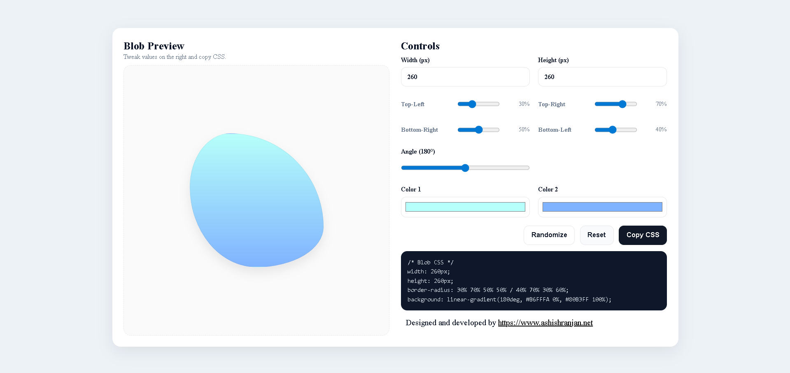

# Blob Generator



React-based blob generator UI built with styled-components.
Generate organic shapes using 8-value border-radius and gradients. Vite-powered and GitHub Pages–ready.

-   **React Hook Form (RHF) + Yup** validation,
-   image preview & clear,
-   header actions (Verify/Delete),
-   **Toastify** toasts, and
-   **localStorage** draft auto-save/restore.
    Vite-powered and GitHub Pages–ready.

## Links

-   **Live:** https://a2rp.github.io/blob-generator/
-   **Repo:** https://github.com/a2rp/blob-generator

## ✨ Features

-   Two-column layout (left: live preview, right: controls)
-   Controls:
    -- Size: Width, Height (px)
    -- Radii: Top-Left, Top-Right, Bottom-Right, Bottom-Left (0–100%)
    -- Gradient: Angle (0–360°), Color 1, Color 2
-   Copy CSS (multi-line, ready to paste)
-   Randomize presets & Reset to defaults
-   All styles scoped with Styled.js (export const Styled = { Wrapper: styled.div`` })

## 🧱 Tech Stack

-   React (Vite)
-   styled-components

## 🚀 Getting Started

```bash
# clone
git clone https://github.com/a2rp/blob-generator
cd blob-generator

# install
npm i

# dev
npm run dev

# build
npm run build

# preview production build
npm run preview
```
